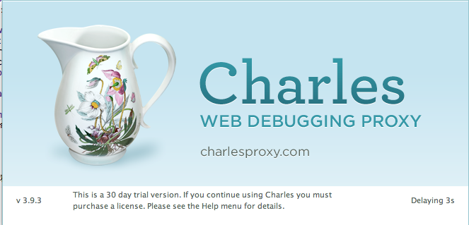
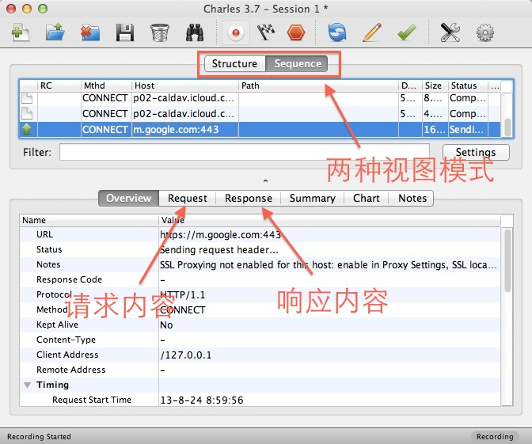
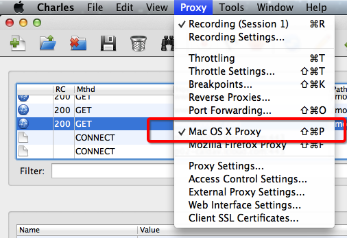
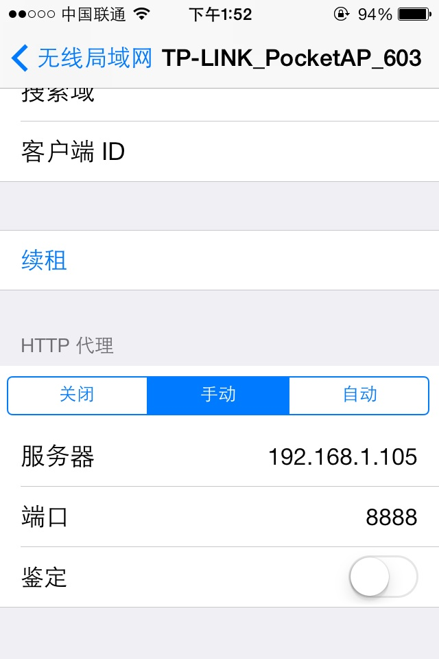
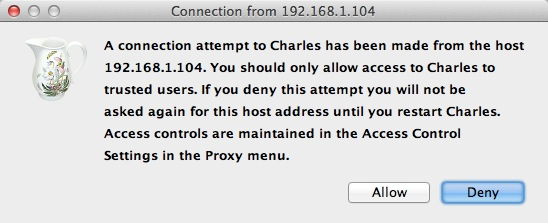
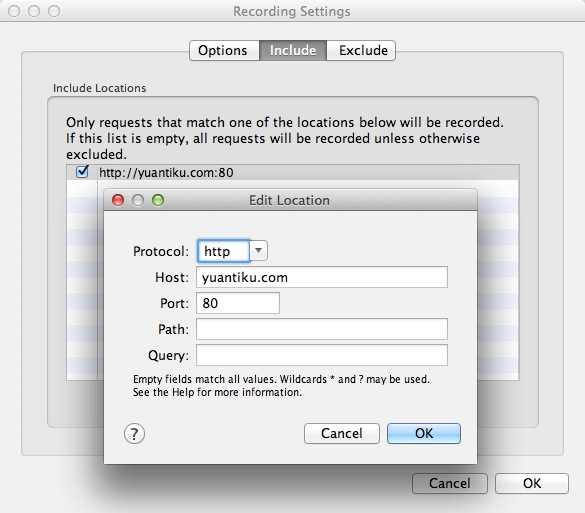
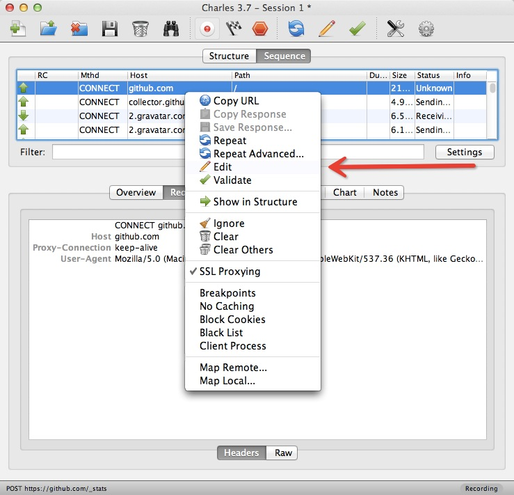
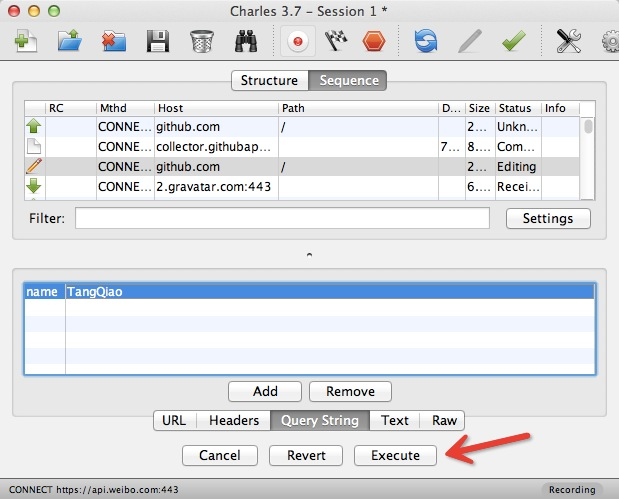
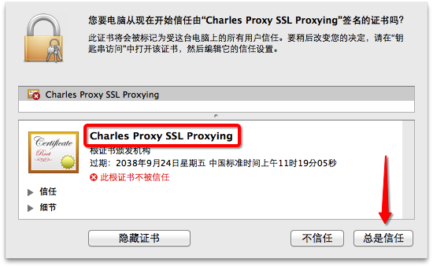
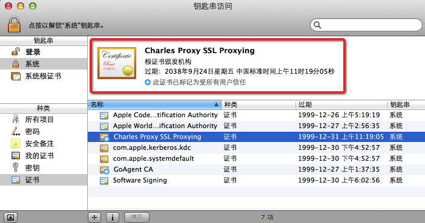

# charles

该部分内容是直接在infoQ的一片文章上面修改扩充而来，[原文链接](http://www.infoq.com/cn/articles/network-packet-analysis-tool-charles)

### charles_introduction

charles是适用于mac的一个抓包工具，特点就是**`上手快`**，[**无限试用**]()，同类型的工具有

* [Wireshark](http://blog.csdn.net/phunxm/article/details/38590561)
	* 非常专业的抓包、分析工具，自不多说，是开源并且跨平台，各种协议通吃的工具，http，tcp都行，非常好的分析工具。
* [Cocoa Packet Analyzer](http://www.tastycocoabytes.com/cpa/)
	* Cocoa Packet Analyzer is a native Mac OS Ximplementation of a network protocol analyzer and packet sniffer. CPA supportsthe industry-standard PCAP packet capture format for reading, capturing and writing packet trace files.
* [Httpscoop](http://www.tuffcode.com/index.html)
	* 支持http协议，`收费`
* [Charles Web Proxy](http://www.charlesproxy.com/documentation/)
	* 适合网页版，手机代理，上手快`收费` 
* [tcpdump](http://www.server110.com/linux/201403/7745.html)
	* 和ssh配合，直接在手机上进行操作，纯命令行
	* 门槛略高 

Charles是`收费软件`，可以`免费试用30天`。试用期过后，未付费的用户仍然可以继续使用，但是每次使用时间不能超过30分钟，并且启动时将会有10秒种的延时。

**Charles主要的功能包括：**

* 支持SSL代理。可以截取分析SSL的请求。
* 支持流量控制。可以模拟慢速网络以及等待时间（latency）较长的请求。
* 支持AJAX调试。可以自动将json或xml数据格式化，方便查看。
* 支持AMF调试。可以将Flash Remoting 或 Flex Remoting信息格式化，方便查看。
* 支持重发网络请求，方便后端调试。
* 支持修改网络请求参数。
* 支持网络请求的截获并动态修改。
* 检查HTML，CSS和RSS内容是否符合W3C标准。

### installion_and_interface
**下载与安装**

去Charles的**官网:**[http://www.charlesproxy.com](http://www.charlesproxy.com)下载最新版的Charles安装包,下载完直接双击安装即可。

**主界面介绍**

Charles主要提供2种查看封包的视图，分别名为`Structure` 和 `Sequence`。

* Structure 视图将网络请求按访问的域名分类。
* Sequence 视图将网络请求按访问的时间排序。

对于某一个具体的网络请求，你可以查看其详细的请求内容和响应内容。

* Overview栏显示的是总体信息，如请求耗时，主机，客户端ip等。然而并没有什么卵用，通常我们会在请求列表页面来看这些信息
* Request栏显示所有的请求信息，进入tab里面，可以看到header，query string(如果请求里面有的话)，data
* Response栏显示所有的请求信息，进入tab里面，可以看到header，query string(如果请求里面有的话)，data

如果响应内容是JSON格式的，那么Charles可以自动帮你将JSON内容格式化，方便你查看。或者你也可以直接查看json raw的形式

### proxy_setting

Charles是通过将自己设置成代理服务器来完成封包截取的，所以使用Charles的第一步是将其设置成系统的代理服务器。

* **系统代理 & 火狐浏览器的代理**
	* 启动Charles后，第一次Charles会请求你给它设置系统代理的权限;你可以输入登录密码授予Charles该权限,也可以忽略该请求。然后在需要将Charles设置成系统代理时，选择菜单中的 “Proxy” –> “Mac OS X Proxy”来将Charles设置成系统代理。如下所示：

之后，你就可以看到源源不断的网络请求出现在Charles的界面中。
* **手机代理**
	* 在Charles的菜单栏上选择“Proxy”->“Proxy Settings”，填入代理端口8888，并且勾上”Enable transparent HTTP proxying” 就完成了在Charles上的设置。如下图所示:

	* 电脑iP查看方式:
		* ifconfig 命令,打开Terminal，输入ifconfig en0, 即可获得该电脑的IP，如下图所示
	
		* 系统偏好设置 —> 网络 
		
* **手机端设置**
	* 在iPhone的 “设置”->“无线局域网“中，可以看到当前连接的wifi名，通过点击右边的详情键，可以看到当前连接上的wifi的详细信息，包括IP地址，子网掩码等信息。在其最底部有“HTTP代理”一项，我们将其切换成手动，然后填上Charles运行所在的电脑的IP，以及端口号8888，如下图所示：
	

设置好之后，我们打开iPhone上的任意需要网络通讯的程序，就可以看到Charles弹出iPhone请求连接的确认菜单（如下图所示），点击“Allow”即可完成设置。

`Attention: `

* 一些比较奇葩的手机即使你设置了代理，也是抓不到包的。这个跟机品有关，跟人品也有关，不能强求
* 设置了代理后，上网的速度是强依赖于 代理机的 网速，然后，你懂得
* 系统代理通常不要勾选，除非你是要分析mac请求，不然累死你
* 连接代理必须在同一个网段才可以。否则心若移动，如何联通

**那么，问题来了。**

`Question:`

1. 如何模拟有网但是网络不通的情况？
2. 一个妹子连接了你的代理，你能不能知道她现在是在认真工作，还是在玩手机？

### filter

通常情况下，我们需要对网络请求进行过滤，只监控向指定目录服务器上发送的请求。对于这种需求，我们有2种办法。

* 在主界面的中部的Filter栏中填入需要过滤出来的关键字。例如我们的服务器的地址是：http://yuantiku.com ,那么只需要在Filter栏中填入yuantiku即可。
* 在Charles的菜单栏选择”Proxy”–>“Recording Settings”，然后选择Include栏，选择添加一个项目，然后填入需要监控的协议，主机地址，端口号。这样就可以只截取目标网站的封包了。如下图所示：

`Attention:`

* 过滤请求有五个维度： **协议**，**host**，**端口**，**路径**，**查询字串**
* host，端口，路径，查询字串 的过滤支持 模糊匹配和正则表达式

**那么，问题来了。**

`Question:`

1. 要快速查看某一个域名下的所有请求，有几种姿势可以选？
2. 怎样配置多个过滤条件？配置的过滤条件都生效？
3. Query的过滤，是经过urlencode后的吗？

### throttle

在测试的时候，我们常常需要`模拟慢速网络或者高延迟的网络`，以测试在移动网络下，应用的表现是否正常。

在Charles的菜单上，选择”Proxy”–>“Throttle Setting”项，在之后弹出的对话框中，我们可以勾选上“Enable Throttling”，并且可以设置Throttle Preset的类型。如下图所示：

如果我们只想模拟指定网站的慢速网络，可以再勾选上图中的”Only for selected hosts”项，然后在对话框的下半部分设置中增加指定的hosts项即可。

### edit_req_resp

**编辑请求**

有些时候为了调试服务器的接口，我们需要反复尝试不同参数的网络请求。Charles可以方便地提供网络请求的修改和重发功能。只需要在以往的网络请求上点击右键，选择“Edit”，即可创建一个可编辑的网络请求。如下所示：

**请求重定向**

我们可以修改该请求的任何信息，包括url地址，端口，参数等，之后点击“Execute”即可发送该修改后的网络请求（如下图所示）。Charles支持我们多次修改和发送该请求，这对于我们和服务器端调试接口非常方便。

**指定返回值**

### breakpoint

### https
上面已经扯到了，https基于SSL，所以要抓包https，就要安装SSL证书，具体步骤如下：

1. 去 http://www.charlesproxy.com/ssl.zip 下载CA证书文件。
解压该zip文件后，双击其中的.crt文件，这时候在弹出的菜单中选择“总是信任”，如下所示：
从钥匙串访问中即可看到添加成功的证书。如下所示：

2. 截取SSL信息。Charles默认并不截取SSL的信息，如果你想对截取某个网站上的所有SSL网络请求，可以在该请求上右击，选择SSL proxy，如下图所示：

这样，对于该Host的所有SSL请求可以被截取到了。

